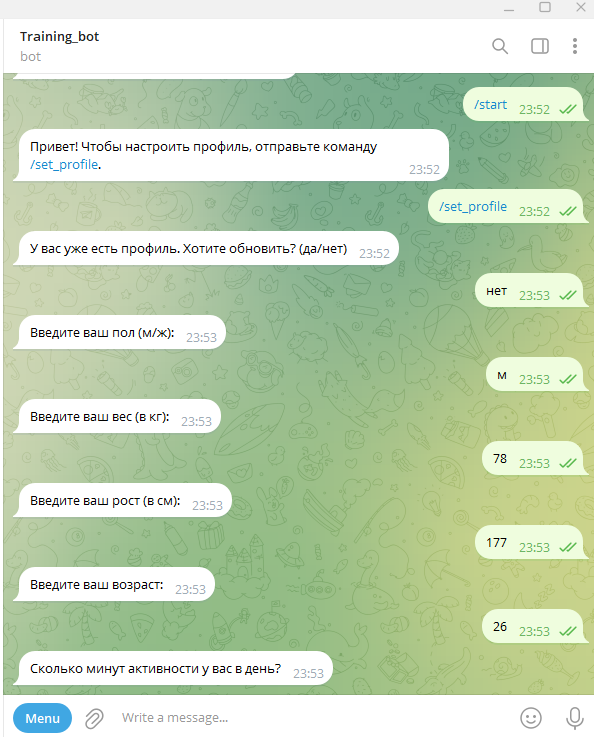
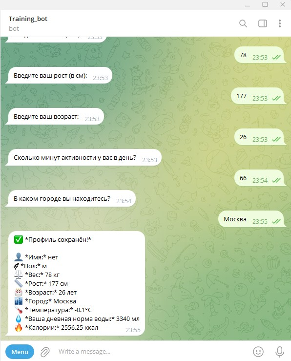
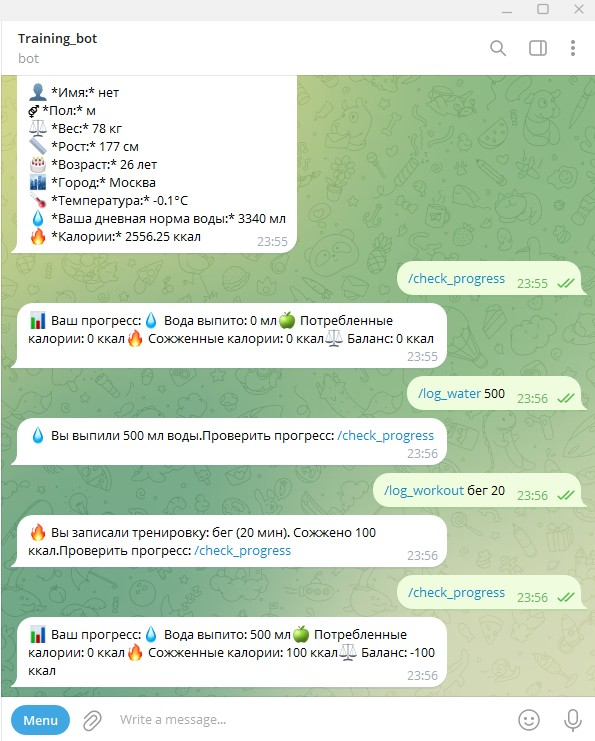
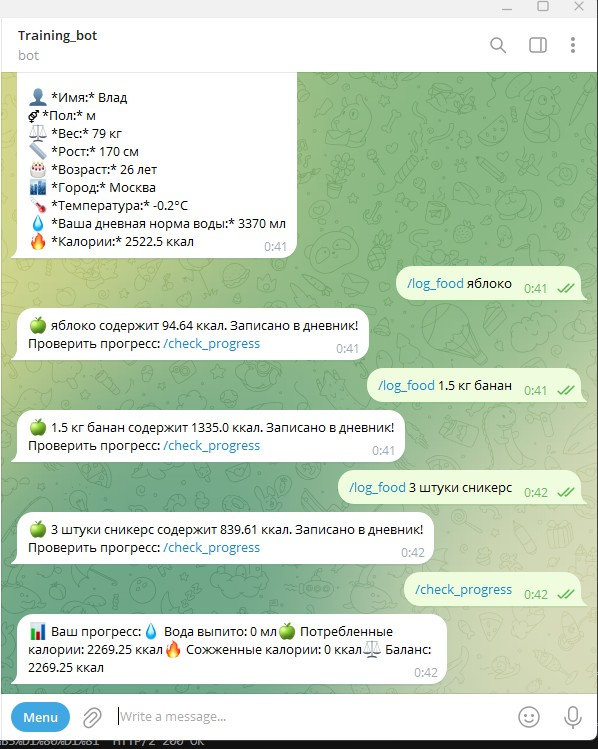
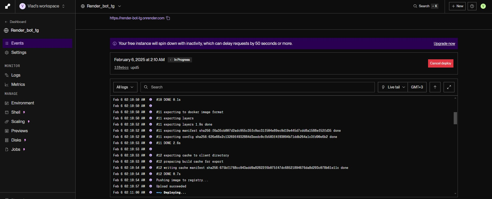
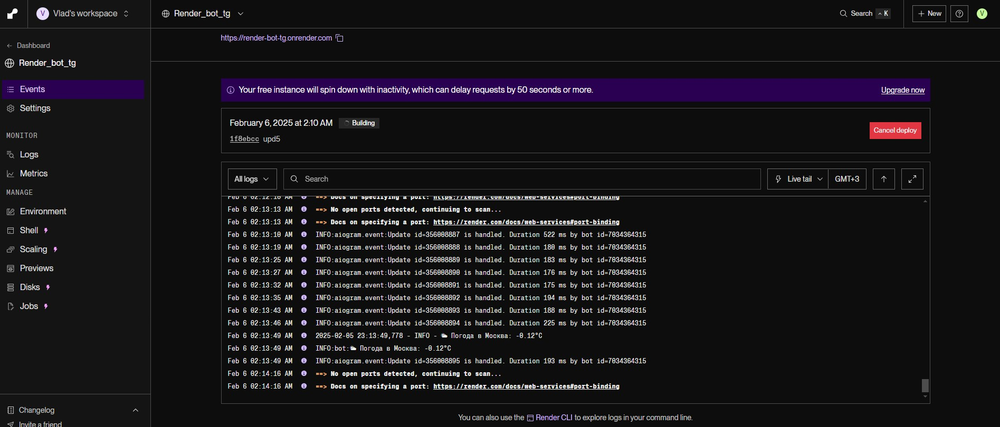

## Telegram-бот для расчёта нормы воды, калорий и трекинга активности

Этот Telegram-бот помогает пользователям рассчитывать норму потребления воды и калорий, а также вести трекинг активности

## Функции:

- Расчёт нормы воды и калорий на основе возраста, веса, роста и активности
- Учет потребления пищи с автоматическим подсчётом калорий через API
- Трекинг потребления воды
- Фиксация физических тренировок и расчёт сожжённых калорий
- Учет температуры наружного воздуха (API OpenWeather)
- Сохранение данных пользователя
- Просмотр прогресса

## Как пользоваться:

1. Запуск бота: `/start`
2. Настройка профиля: `/set_profile`
3. Добавить еду: `/log_food <продукт>`  
   Пример: `/log_food 200 г яблоко`
4. Добавить воду: `/log_water <мл>`  
   Пример: `/log_water 500`
5. Добавить тренировку: `/log_workout <тип> <мин>`  
   Пример: `/log_workout бег 30`
6. Проверить прогресс: `/check_progress`

# Telegram-бот для расчёта нормы воды, калорий и трекинга активности

Этот Telegram-бот помогает пользователям рассчитывать норму потребления воды и калорий, а также вести трекинг активности.

## Функции:

- Расчёт нормы воды и калорий на основе возраста, веса, роста и активности
- Учет потребления пищи с автоматическим подсчётом калорий через API
- Трекинг потребления воды
- Фиксация физических тренировок и расчёт сожжённых калорий
- Учет температуры наружного воздуха (API OpenWeather)
- Сохранение данных пользователя
- Просмотр прогресса

## Как пользоваться:

1. Запуск бота: `/start`
2. Настройка профиля: `/set_profile`
3. Добавить еду: `/log_food <продукт>`  
   Пример: `/log_food 200 г яблоко`
4. Добавить воду: `/log_water <мл>`  
   Пример: `/log_water 500`
5. Добавить тренировку: `/log_workout <тип> <мин>`  
   Пример: `/log_workout бег 30`
6. Проверить прогресс: `/check_progress`

## Пример работы:

## Деплой:

